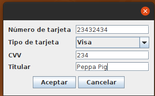

# GUI Forms

Los siguientes ejercicios deben implementarse utilizando el editor de GUI Forms

## Parte 1 - Tabla de tarjetas (2 puntos)

Modifica `CreditCardApp` de forma que la tabla muestre correctamente los datos de 
las tarjetas de crédito definidas en el código.

### Calificación  (2 puntos)

El ejercicio puntuará cero puntos en los siguientes casos:
- No compila
- No arranca la ventana
- No se ha configurado la tabla y su modelo correctamente

## Parte 2 - Diseño de formularios (2 puntos)

Crea un formulario llamado `AddCreditCardForm` con esta distribución

- Carga en el `JComboBox` los valores: Visa, MasterCard y American Express
- Los botones deben estar centrados
- El número de tarjeta y el CVV deben ser números

### Calificación  (2 puntos)

El ejercicio puntuará cero puntos en los siguientes casos:
- No compila
- No arranca la ventana

## Parte 3 - Navegación (3 puntos)

### Barra de menú

Añade al JFrame una barra de menús con DOS menús:
- Tarjetas
  - Agregar
  - Eliminar
  - Modificar
- Gastos
  - Listar
  - Añadir
  - Eliminar

### Diálogo de añadir

Al pulsar el botón "Añadir" o el JMenuItem "Añadir" del menú de tarjetas, se debe abrir un `JDialog` con el formulario 
definido en `AddCreditCardForm`

### Calificación  (3 puntos)

El ejercicio puntuará cero puntos en los siguientes casos:
- No compila
- No arranca la ventana
- No hay ningún elemento de navegación
